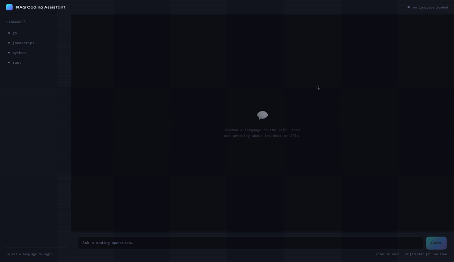

# RAG Coding Assistant

[](https://github.com/hcodes8/rag-coding-assistant/actions/workflows/ci.yml)

[](LICENSE)

A desktop chat assistant that answers programming questions **grounded in real documentation**, not model memory. Point it at any language's docs, and it retrieves the relevant passages with vector search, streams an LLM answer token-by-token, and cites the source files it drew from.



## Quick start

Requires Python 3.10+ and a free [OpenRouter](https://openrouter.ai/keys) API key.

```bash
git clone https://github.com/hcodes8/rag-coding-assistant.git
cd rag-coding-assistant
python -m venv venv
venv\Scripts\activate        # Windows   (Linux/macOS: source venv/bin/activate)
pip install -r requirements.txt

# configure
copy .env.example .env       # then paste your OpenRouter key into .env
```

### Add documentation

```bash
python scripts/fetch_docs.py all --ingest
```

This downloads doc sets (official Python docs, the Rust book, go.dev docs, javascript.info) and pre-builds the search index so the app is ready instantly. Embedding is a one-time, CPU-bound step — about a minute per couple thousand chunks; the full Python docs are the big one at roughly 10 minutes. Run `--list` to see sources, or pass specific names (`python scripts/fetch_docs.py rust go`). Skip `--ingest` and the app will index a language the first time you select it instead.

To add a language that isn't built in, register it in the `SOURCES` dict at the top of `scripts/fetch_docs.py`. Any zip of `.txt`/`.md`/`.rst` files works, and every GitHub repo is one — lots of official docs are markdown repos:

```python
"typescript": Source(
    url="https://github.com/microsoft/TypeScript-Website/archive/refs/heads/v2.zip",
    subdir="packages/documentation/copy/en/",  # extract only this folder
    note="official TypeScript handbook",
),
```

Then fetch and index it the same way: `python scripts/fetch_docs.py typescript --ingest`. Non-text files are skipped automatically, and the new language shows up in the sidebar on next launch.

### Run

```bash
python -m app.main
```

Pick a language in the sidebar and start asking questions.

## License

[MIT](LICENSE)
